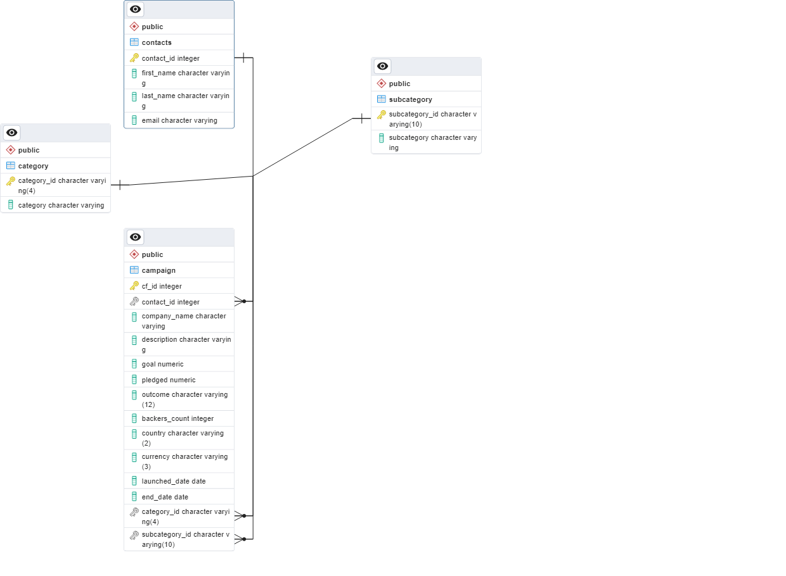

# Crowdfunding_ETL

## Purpose
The Crowdfunding Database is a collection of data that provides insights into various crowdfunding campaigns, their categories, subcategories, and participant engagement. Whether you're a data analyst, researcher, or simply curious about crowdfunding trends, this database offers valuable information for analysis and exploration.

## Data Structure
The database comprises four main components:

### category
The `category` table contains information about different campaign categories. Each category has a unique identifier (`category_id`) and a corresponding name (`category`), such as "Technology," "Music," and "Games."

### subcategory
The `subcategory` table contains information about subcategories linked to categories. It includes a unique identifier (`subcategory_id`), a name (`subcategory`).

### campaigns
The `campaigns` table offers comprehensive insights into individual crowdfunding campaigns. It encompasses:

- A unique campaign identifier (`cf_id`).
- The participant's contact identifier (`contact_id`), linking to the `Contacts` table to establish associations between participants and specific campaigns.
- The company's name (`company_name`).
- A description (`description`) elaborating on the campaign's purpose.
- The campaign's launch date (`launched_date`) and end date (`end_date`).
- The `category_id` and `subcategory_id` linking the campaign to specific category and subcategory identifiers.

### contacts
The `contacts` table contains participant contact information. Each participant is identified by a unique identifier (`contact_id`) and is associated with a first name (`first_name`), last name (`last_name`), email address (`email`).

Data Files
The Crowdfunding Database includes the following CSV files:

- `categories.csv`: Contains information about campaign categories.
- `subcategories.csv`: Contains information about subcategories.
- `campaigns.csv`: Holds details about crowdfunding campaigns, including their names, descriptions, dates, categories and subcategories.
- `contacts.csv`: Includes contact details for participants engaged in various campaigns.

### Database Creation and Usage
The Crowdfunding Database is created with a meticulous approach, ensuring its integrity and usability:

  1. **Database Schema Creation**: The schema for the database is defined in the `crowdfunding_db_schema.sql` file. This schema outlines the structure of the database, including tables, columns, primary and foreign keys, and their relationships.

  2. **Database Initialization**: By executing the `crowdfunding_db_schema.sql` file, you establish the foundation of the `crowdfunding_db` database. This step ensures the structure is ready to accommodate the incoming data.

  3. **CSV Data Import**: The provided CSV files (`category.csv`, `subcategory.csv`, `campaigns.csv`, and `contacts.csv`) are essential for populating the database with meaningful data. Import each CSV file into its respective table within the `crowdfunding_db`.

  4. **SQL Queries and Analysis**: Leverage SQL queries to explore and analyze the data. For instance, using a `SELECT *` statement allows you to examine the contents of each table, facilitating insights and discoveries.

  
